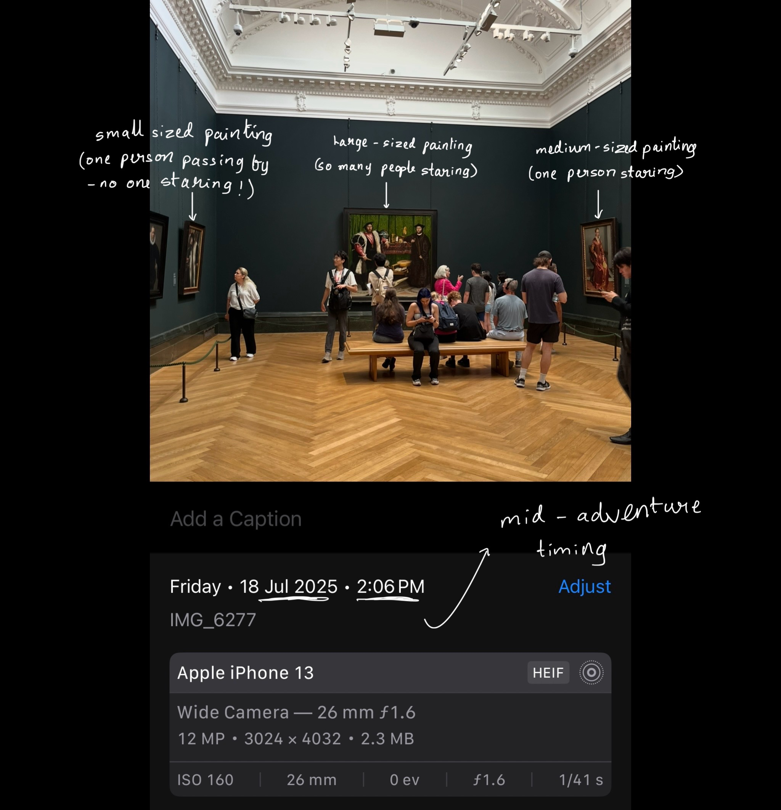

# What attracts people to paintings the most?
**Author - [Srishti Sahu](https://github.com/srishtisahu03)**

This data-driven investigation explores the factors that attract people to museum paintings!

---

## 🧠 Project Goal

This project analyzes a dataset of paintings to explore how different attributes—such as **size**, **brightness**, and **number of people nearby**—interact with one another. The analysis includes descriptive statistics, pivot tables, and visualizations to reveal patterns in the data.
We rely on manually collected data from the National Gallery Museum to *possibly* come up with conclusions. The data collected is based on observation and is primary data. Here is an example of how it was collected!

---

## 📁 Dataset Overview

The dataset includes the following key columns:

- `artist`: Name of the artist (irrelevant to our analysis)

- `painting name`: Name of the painting (irrelevant to our analysis)

- `use of colour`: How extensive the colour palette is (Low, Medium or High)

- `size`: Size category of the painting (Small, Medium or Large)

- `brightness`: Brightness level of the painting (Dull, Moderate or Bright)

- `people_near`: Number of people observing the painting 

---

## 📊 Visualizations

The following visualisations were created for the analysis:

- `bar plots`: Three different bar plots comparing the size, brightness and colourfulness to the average number of people respectively

- `heatmaps`: Two different heatmaps showing the combined effect of brightness and size, & colourfulness and size 

- `boxplots`: Used to show anomalies

---

## 🗂️ Project Structure

├── data/

│ ├── database.db # SQLite database version of the dataset

│ └── raw.csv # Raw CSV data collected manually

├── docs/

│ ├── images/

│ │ └── IMG_6277.png # Reference image of gallery layout

│ └── index.md # Documentation for GitHub Pages or other use

├── notebooks/

│ ├── NB01-data-collection.ipynb # Initial data entry and preprocessing

│ ├── NB02-data-analysis.ipynb # Descriptive statistics and cleaning

│ ├── NB03-analysis.ipynb # Visualization and deeper analysis

│ └── images/ # Plots and outputs from notebooks

├── README_files/ # Auto-generated

├── README.md 

└── .gitignore

---

## 🧠 Key Findings

- Bar charts showed that when analyzed individually, all three factors — brightness, size, and colourfulness — followed an increasing pattern: higher intensity led to more people being attracted.

- Interestingly, the heatmaps revealed that the highest attention was drawn to moderately bright + large-sized paintings and low colourfulness + large-sized paintings — an unexpected result.

- This anomaly was reinforced by the boxplots for brightness and colourfulness, which suggested outliers or unusual distributions in the data.
