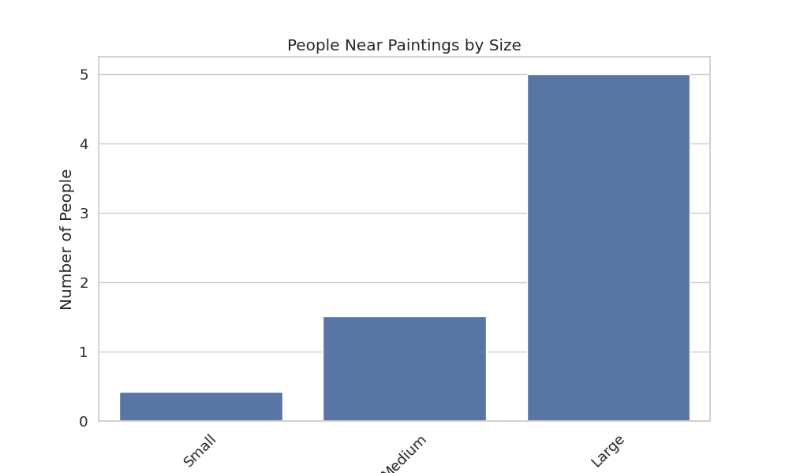
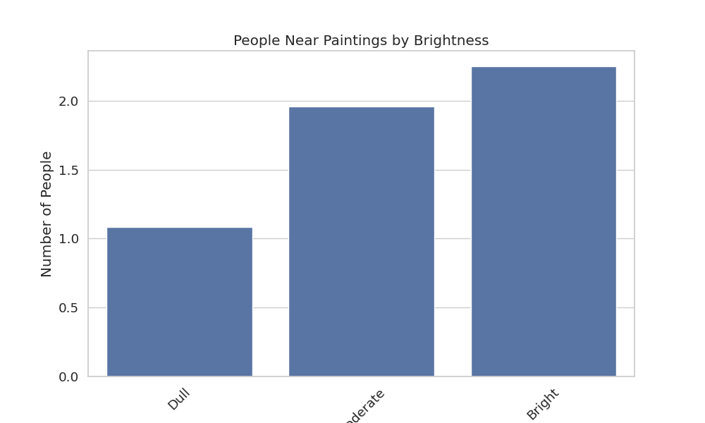
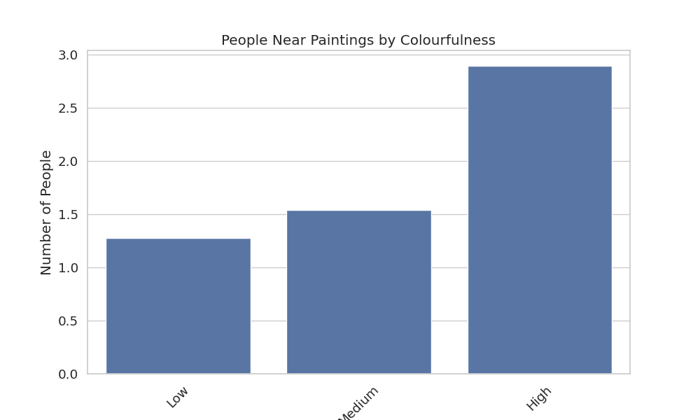
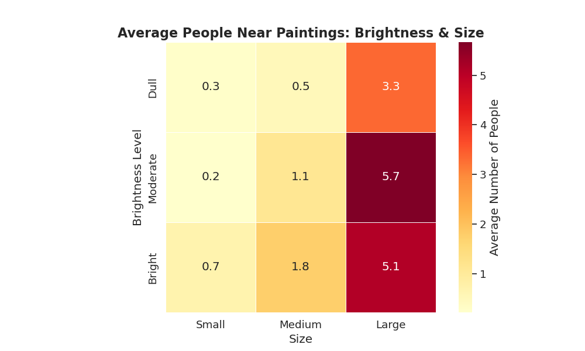
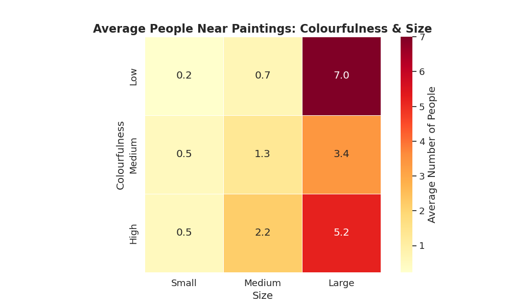
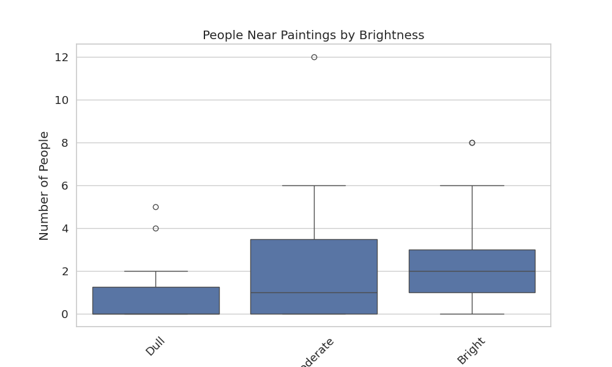
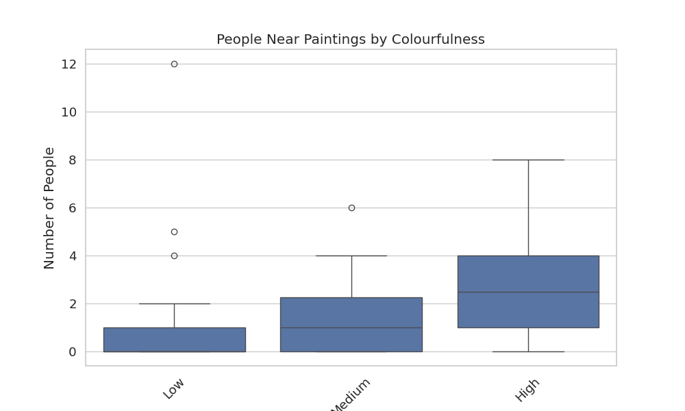

# 🎨 Art Perception Analysis

## 🧪 Project Overview

This project explores how three visual factors—**brightness**, **size**, and **colourfulness**—influence the number of people attracted to different paintings. Using a synthetic dataset collected from controlled observations, we examine patterns and anomalies in visual preferences using various plots and statistical visualizations.

---

## 🧠 Key Findings

📈 When analysed individually, all three factors—brightness, size, and colourfulness—show an **increasing pattern** in the number of people attracted as the **intensity increases**.

🔥 According to the heatmaps, the **most attention** was drawn to:

  - **Moderately bright + large** sized paintings.

  - **Low colourfulness + large** sized paintings.  

  This is a bit unexpected, isn’t it?

    

    

The reason behind this can be seen using box plots for brightness and colourfulness as it shows outliers:

As seen, there are outliers in both the boxplots resulting in the strange results from the heatmaps!!

---

## 💡 Conclusions

- **Size matters most**—larger paintings consistently attracted more viewers.
- **Brightness has a sweet spot**—extremely bright or dim artworks were less appealing.
- **Colourfulness** isn’t always linear—sometimes low-colour paintings performed better, possibly due to minimalism or contrast.
